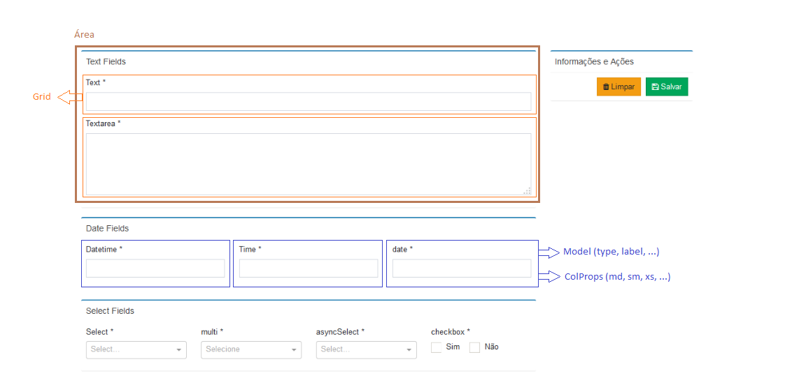

# React Json From
A React component that generates forms from a json

## Por quê?
Criar formulários em React às vezes pode ser um tanto quanto verboso.
E em cenários onde um sistema web possui muitos formulários, o esforço para criar formulários acaba consumindo muito tempo e esse trabalho geralmente é bastante repetitivo.
___


## Componente
```
import JsonForm from 'react-json-form';
```
## Estilo
Você pode importar o **Bootstrap**, **Font Awesome** e **Admin Lte** separadamente de acordo com necessidade do seu projeto ou importar o arquivos `default.css` disponível no módulo.
```
import 'react-json-form/dist/JsonForm/styles/defaults.css';
```

## Demonstração Básica 
Para demonstrar as possibilidades do **React Json Form** se não for passado nenhum parâmetro ao componente ele irá renderizar um formulário de exemplo.
```
<JsonForm />
```


## Exemplo
```
<JsonForm
    layout={this.state.layout}
    onSuccess={(data, layout) => { this.onSuccess(data, layout); }}
    onError={(data, layout) => { this.onError(data, layout); }}
    initialData={this.props.formData}
/>
```
### Propriedades:

| Prop   |   Type   |  default  |    Descrição      |  Exemplo |
|--------|----------|-----------|-------------------|------|
| layout |   *array*   |      |  Array objetos que definem as áreas, os campos e as condições de validação. | <a href="#layout">Mais detalhes</a>   |
| onSuccess |   *function*   |      |  função que ao formulário passar por todas as validações recebe o json do formulário preenchido e o novo layout com os valores atualizados   |  `(data, layout) => { cosole.log(data, layout); }` |
| onError |   *function*   |      | função que ao formulário falhar em validação recebe o json do formulário preenchido e o novo layout com os valores atualizados |  `(data, layout) => { cosole.log(data, layout); }` |
| initialData |   *object*   |     | Json com os valores iniciais do formulário | `{name: "Foo", phone: "bar"}` |
| displayButtons |   *boolean*   |   `true`  | define a exibição ou não dos botões padrão do componente (Limpar e Salvar)  | `true` |
| tabs |   *boolean*   |   `false`  | define o uso ou não de abas no componente.  <a href="#tabs">Mais detalhes</a>| `true` |
| children |   *React Component*   |   `false`  | Compoententes filhos que são renderizados na parte lateral do formulário. <a href="#children-botões-personalizados">Mais detalhes</a> | `<div>:)</div>` |

___

## Layout


<p style="font-size: 18px">
  O layout é um array de objetos. E cada objeto representa uma <strong>Área</strong> do formulário.
</p>

### Áreas
  Representa as seções do formulários. Cada área é um objeto dentro do array.
  <pre><code>&lt;JsonForm layout={[
    {/* área 1 */},
    {/* área 2 */},
    {/* área N */},
]} /></code></pre>

Abaixo podemos ver a estrutura de uma área:
- Área 

  - Grid

    - Model
      - validation
      - type
      - name
      - label
      - options
      - loadoptions
      - required
      - validation
      - inputProps
    - custom
    - colProps
  - Content
  - tab
  - tabTitle

### Propriedades de uma área 
<table>
  <thead>
    <tr>
      <th>Prop</th>
      <th>Type</th>
      <th>Descrição</th>
    </tr>
  </thead>
  <tbody>
    <tr>
      <td>grid</td>
      <td><i>array</i></td>
      <td>
        <p>
          Representa as linhas (Row) pertencentes à área
        </p>
        <pre><code>[[/* linha 1 */], [/* linha 2 */], [/* linha N */]]</code></pre>
        <h4>Itens do array</h4>
        <h5>- Linhas (Row):</h5>
        cada linha pode conter até 12 colunas. E é nesse nível onde se define as características de cada campo do forumário 
  <pre><code>[
    [
      // linha 1
      {
        model: {},
        custom: {},
        colProps: { md: 12 },
      },
    ],
    [
      /* linha 2 */
      {
        model: {},
        custom: {},
        colProps: { md: 6 },
      },
      {
        model: {},
        custom: {},
        colProps: { md: 6 },
      },
    ],
  ]</code></pre>
        <strong>- Propriedades das linhas:</strong>
        <table>
          <thead>
            <tr>
              <th>Prop</th>
              <th>Type</th>
              <th>Descrição</th>
            </tr>
          </thead>
          <tbody>
            <tr>
              <td>model</td>
              <td><i>object</i></td>
              <td>
                Objeto que define o comportamento do campo de formulário. Nele são especificados o <code>tipo, name, label, obrigatoriedade e regras de validação</code>. <a href="#model">Mais detalhes</a>
              </td>
            </tr>
            <tr>
              <td>custom</td>
              <td><i>function</i></td>
              <td>Essa propriedade permite que um componente personalizado seja inserido em uma coluna. Pode ser um componente estático ou um novo tipo de campo. <a href="#custom-inputs-personalizados">Mais detalhes</a>.
              <br><i>Importante: ao utilizar essa propriedade, o campo padrão do formulário não será exibido.<i>
              </td>
            </tr>
            <tr>
              <td>colProps</td>
              <td><i>object</i></td>
              <td>Objeto que define as propriedades do componente <code>Col</code>  do Bootstrap.
              <pre><code>{ md: 6, sm: 12 }</code></pre>
              </td>
            </tr>
          </tbody>
        </table>
      </td>
    </tr>
    <tr>
      <td>content</td>
      <td><i>function</i></td>
      <td>
        Conteúdo extra inserido no final da área.
        <pre><code>() => &lt;div> :P &lt;/div></code></pre>
      </td>
    </tr>
    <tr>
      <td>tab</td>
      <td><i>number</i></td>
      <td>
        <p>Id da aba à qual a área em questão pertence.</p>
        <p><strong>Importante</strong>:Áreas diferentes podem pertencer à mesma aba.</p>
      </td>
    </tr>
    <tr>
      <td>tabTitle</td>
      <td><i>string</i></td>
      <td>
        <p>Título da aba à qual a área em questão pertence.</p>
        <p><strong>Importante</strong>: Caso queira utilizar a mesma aba para várias áreas, utilize a propriedade <code>tabTitle</code> em apenas uma delas (para evitar duplicação títulos).</p>
      </td>
    </tr>
  </body>
</table>

___

## model
Model é uma propriedade que define as características e comportamento de um campo do formulário.

### Propriedades Gerais
<table>
  <thead>
    <tr>
      <th>Prop</th>
      <th>Type</th>
      <th>Descrição</th>
    </tr>
  </thead>
  <tbody>
    <tr>
      <td>type</td>
      <td><i>string</i></td>
      <td>Tipo do input. As opções disponíveis são as seguintes:<br/>
        <code>text</code>, 
        <code>textarea</code>, 
        <code>datetime</code>, 
        <code>time</code>, 
        <code>date</code>, 
        <code>select</code>, 
          <code>multiCreatable</code>, 
        <code>multi</code>, 
        <code>asyncSelect</code>, 
        <code>checkbox</code>
      </td>
    </tr>
    <tr>
      <td>name</td>
      <td><i>string</i></td>
      <td>
        <p>propriedade <code>name</code> da tag  <code>&lt;input /></code>.</p>
        <p><strong>Dica</strong>: Uma boa prática é atribuir o mesmo nome do campo correspondente no banco de dados</p>
      </td>
    </tr>
    <tr>
      <td>label</td>
      <td><i>string</i></td>
      <td>Título do campo do formulário</td>
    </tr>
    <tr>
      <td>required</td>
      <td><i>boolean</i></td>
      <td>Define se o campo é obrigatório</td>
    </tr>
    <tr>
      <td>validation</td>
      <td><i>function</i></td>
      <td>
        <p>Função para validar o valor do campo.</p>
        <p>
          <strong>Entrada</strong>: parâmetro <code>string</code> com o valor do atual do campo<br/>
          <strong>Saída</strong>: objeto com o formato <code>{ valid: /*boolean*/, message: /*string*/ }</code>
        </p>
        <p>
<pre><code>
(val) => {
  if (val.length < 10) {
    return { valid: false, message: 'O campo nome deve conter mais de 10 caracteres' };
  }
  return { valid: true, message: 'ok' };
}
</code></pre>
        </p>
        <p></p>
      </td>
    </tr>
    <tr>
      <td>inputProps</td>
      <td><i>object</i></td>
      <td>
        <p>Propriedades extras para a tag <code>&lt;input /></code></p>
        <pre><code>{disabled: true}</code></pre>
      </td>
    </tr>
    <tr>
      <td colSpan="3">
        <br/>
        <p>
          <strong>Propriedades válidas para os seguintes tipos:</strong>
          <code>select</code>, 
          <code>multi</code>, 
          <code>multiCreatable</code>, 
          <code>checkbox</code>
        </p>
      </td>
    </tr>
    <tr>
      <td>Options</td>
      <td><i>array of objects</i></td>
      <td>
        <p>Opções de valores pre-estabelecidas no formato  <code>{ label: /*string*/, value: /*string ou boolean*/ }</code>.
        </p>
<pre><code>
[
  { label: 'Sim', value: 'sim' },
  { label: 'Não', value: 'nao' },
],
</code></pre>
      </td>
    </tr>
    <tr>
      <td colSpan="3">
        <br/>
        <p>
          <strong>Propriedades válidas para os seguintes tipos:</strong>
          <code>asyncSelect</code>
        </p>
      </td>
    </tr>
    <tr>
      <td>loadOptions</td>
      <td><i>function</i></td>
      <td>
        <p>Função responsável pelo carregamento assíncrono das opções de valor de um campo <code>asyncSelect</code></p>
        <p>
          <strong>Entrada</strong>: parâmetro <code>string</code> com o valor do atual do campo<br/>
          <strong>Saída</strong>: uma Promise resolvida retornando um objeto com o formato <code>{ options: /*array of objects*/}
        </p>
<pre><code>
loadOptions: (input) => {
  if (!input) {
    return Promise.resolve({ options: [] });
  }
  return axios.get(`https://api.github.com/search/users?q=${input}`)
    .then((json) => {
      console.log('json', json);
      return { options: json.data.items };
    });
},
</code></pre>
      </td>
    </tr>
    <tr>
      <td>labelKey</td>
      <td><i>string</i></td>
      <td>
        <p>Em um <code>asyncSelect</code> o objeto que representa uma option não possui um formato padronizado (depende do retorno da requisição)</p>
        <p>Então o <code>labelKey</code> Define o nome da propriedade a ser utilizada como <strong>label</strong> uma option. </p>
        <code>labelKey: 'login'</code>
      </td>
    </tr>
    <tr>
      <td>valueKey</td>
      <td><i>string</i></td>
      <td>
        <p>Em um <code>asyncSelect</code> o objeto que representa uma option não possui um formato padronizado (depende do retorno da requisição)</p>
        <p>Então o <code>labelKey</code> Define o nome da propriedade a ser utilizada como <strong>valor</strong> uma option. </p>
        <code>valueKey: 'id'</code>
      </td>
    </tr>
    <tr>
      <td>onValueClick</td>
      <td><i>function</i></td>
      <td>
        <p>Define uma ação extra selecionar uma das opções disponíveis</p>
<pre><code>
onValueClick: (value, event) => {
  console.log('asyncSelect::value', value);
  console.log('asyncSelect::event', event);
},
</code></pre>
      </td>
    </tr>
  </tbody>
</table>

### Layout Exemplo
<p>Uma boa prática presente no exemplo abaixo é separar o <strong>model</strong> e referenciá-lo dentro do layout.<p>

```
const model = {
  tipoRequisicao: {
    type: 'select',
    name: 'tipoRequisicao',
    value: '',
    label: 'Tipo de Requisição',
    options: [
      { label: 'Aditivo', value: 'Aditivo' },
      { label: 'Consulta Referencial', value: 'Consulta Referencial' },
      { label: 'Exceção', value: 'Exceção' },
      { label: 'Licitação Formal Padrão', value: 'Licitação Formal Padrão' },
    ],
    required: false,
    validation: (val) => ({ valid: true, message: "ok" }),
    inputProps:{disabled: true},
  },
  natureza: {
    type: 'select',
    name: 'natureza',
    value: '',
    label: 'Natureza',
    options: [
      { label: 'Fornecimento', value: 'Fornecimento' },
      { label: 'Processo', value: 'Processo' },
      { label: 'Serviço', value: 'Serviço' }
    ],
    required: false,
    validation: (val) => ({ valid: true, message: "ok" }),
    inputProps:{},
  },
  escopoSumario: {
    type: 'text',
    name: 'escopoSumario',
    value: '',
    label: 'Escopo Sumário',
    required: false,
    validation: (val) => ({ valid: true, message: "ok" }),
    inputProps:{},
  },
  escopo: {
    type: 'textarea',
    name: 'escopo',
    value: '',
    label: 'Descrição do Escopo',
    required: false,
    validation: (val) => ({ valid: true, message: "ok" }),
    inputProps:{},
  },
  localPrincipalAtividade: {
    type: 'select',
    name: 'localPrincipalAtividade',
    value: '',
    label: 'Local principal de execução das atividades do escopo da contratação',
    options: [
      { label: 'Filial 1', value: 'Filial 1' },
      { label: 'Filial 2', value: 'Filial 2' },
      { label: 'Filial 3', value: 'Filial 3' },
    ],
    required: false,
    validation: (val) => ({ valid: true, message: "ok" }),
    inputProps:{},
  },
  responsavelTransporte: {
    type: 'select',
    name: 'responsavelTransporte',
    value: '',
    label: 'Responsável pelo Transporte',
    required: false,
    options: [
      { label: 'Contratada', value: 'Contratada' },
      { label: 'Corp.com', value: 'Corp.com' },
      { label: 'Não Aplicável', value: 'Não Aplicável' }
    ],
    validation: (val) => ({ valid: true, message: "ok" }),
    inputProps:{},
  },
  responsavelFornecimentoMaterial: {
    type: 'select',
    name: 'responsavelFornecimentoMaterial',
    value: '',
    label: 'Responsável pelo Fornecimento de Material',
    options: [
      { label: 'Contratada', value: 'Contratada' },
      { label: 'Corp.com', value: 'Corp.com' },
      { label: 'Não Aplicável', value: 'Não Aplicável' }
    ],
    required: false,
    validation: (val) => ({ valid: true, message: "ok" }),
    inputProps:{},
  },
  observacao: {
    type: 'textarea',
    name: 'observacao',
    value: '',
    label: 'Comentário / Observações',
    required: false,
    validation: (val) => ({ valid: true, message: "ok" }),
    inputProps:{},
  },
  possuiPrevisaoOrcamentaria: {
    type: 'checkbox',
    name: 'possuiPrevisaoOrcamentaria',
    value: '',
    label: '',
    options: [
      { label: 'Sim', value: true },
      { label: 'Não', value: false },
    ],
    required: false,
    validation: (val) => ({ valid: true, message: "ok" }),
    inputProps:{},
  },
  verbaPrevista: {
    type: 'text',
    name: 'verbaPrevista',
    value: '',
    label: 'Verba Prevista',
    required: false,
    validation: (val) => ({ valid: true, message: "ok" }),
    inputProps:{},
  },
};
```
```
const layout = [
  {
    title: 'Processo para Contratação',
    tab: 1,
    tabTitle: 'Etapa 1',
    grid: [
      [
        { model: model.tipoRequisicao, colProps: { md: 3 } },
        { model: model.natureza, colProps: { md: 6 } },
      ],
      [
        { model: model.escopoSumario, colProps: { md: 12 } },
      ],
      [
        { model: model.escopo, colProps: { md: 12 } },
      ],
    ],
    content: () => <div>:)</div>,
  },
  {
    title: 'Processo para Contratação',
    tab: 1,
    grid: [
      [
        { model: model.localPrincipalAtividade, colProps: { md: 3 } },
        { custom: (action) => <div>Info</div>, model: model.localPrincipalAtividade, colProps: { md: 3 } },
        { model: model.responsavelTransporte , colProps: { md: 3 } },
        { model: model.responsavelFornecimentoMaterial , colProps: { md: 3 } },
      ],
      [
        { model: model.observacao, colProps: { md: 12 } },
      ],
    ],
  },
  {
    title: 'Previsão Orçamentária',
    tab: 2,
    tabTitle: 'Etapa 2',
    grid: [
      [
        { model: model.possuiPrevisaoOrcamentaria, colProps: { md: 4 } },
        { model: model.verbaPrevista , colProps: { md: 8 } },
      ],
    ],
  },
];
```
___

## custom (Inputs personalizados)

Caso queira renderizar um componente dentro do grid, ou deseja criar um campo personalizado, é possível fazê-lo através da propriedade.

**Exemplo de campo personalizado:**

```
function CustomField({
  model,
  parentState,
  validateField,
  onChange,
  onSelectChange,
  onMultiSelectChange,
  onAsyncChange,
  onDateTimeChange,
  onInputChange,
  checkRequirement,
}) {
  return (
    <Select
    name={model.name}
    noResultsText={model.noResultsText || 'Sem Resultados'}
    options={model.options}
    value={parentState[model.name]}
    onChange={(value) => {
      onSelectChange(model.name)(value);
    }}
    onBlur={() => {
      validateField(model.name, parentState[model.name], checkRequirement);
    }}
    {...model.inputProps}
    />
  );
}
```

**inserindo campo personalizado:**

```
<JsonForm
  layout={[{
    title: 'Processo para Contratação',
    grid: [
      [
        ...
        { custom: CustomField, model: model.localPrincipalAtividade, colProps: { md: 3 } },
        ...
      ]
    ],
  }]}
/>
```
___

## children (Botões personalizados)
Na lateral direira do formulário existe uma área onde é possível inserir componentes extras.
Esses componentes devem ser filhos do componente JsonForm.

Além disso, também é possível utilizar botões de ação dentro desses componentes.
Existem 3 propriedades inserida à todos os filhos que permitem que isso aconteça: `JF_clearForm`, `JF_saveForm`, `JF_getFormData`.

| Prop   |  Descrição  |
|--------|----------|
| JF_clearForm |  Limpa o formulário  |
| JF_saveForm |   Salva o formulário  |
| JF_getFormData |   Retorna os valores atuais do formulário (sem salvar e validar)   |

**Exemplo**

```
function ExtraInfo({
  JF_clearForm,
  JF_saveForm,
  JF_getFormData,
  data = {}
}) {
  const { requisitanteNome } = data;
  return (
    <div className="box box-primary">
    <div className="box-header">
      <h3 className="box-title">Informações e Ações</h3>
    </div>
    <div className="box-body">
      <Row>
          <Col md={4}>
              <ControlLabel>Requisitante:</ControlLabel>
          </Col>
          <Col md={8}>
              {requisitanteNome}
          </Col>
      </Row>
    </div>
    <div className="box-footer text-right">
      <Button
        bsStyle="primary"
        className="btn-flat btn-warning"
        onClick={JF_clearForm}
      >
        <i className="fa fa-trash" /> Limpar
      </Button>
      &nbsp;&nbsp;
      <Button
        bsStyle="primary"
        className="btn-flat btn-success"
        onClick={JF_saveForm}
      >
        <i className="fa fa-save" /> Salvar
      </Button>
    </div>
  </div>);
}
```

```
<JsonForm
  layout={this.state.layout}
  initialData={this.props.data}
  onSuccess={this._submitData}
  onError={(data, layout) => {console.log('data', data)}}
  displayButtons={false}
  tabs
>
  <ExtraInfo data={this.props.data} />
</JsonForm>
```
