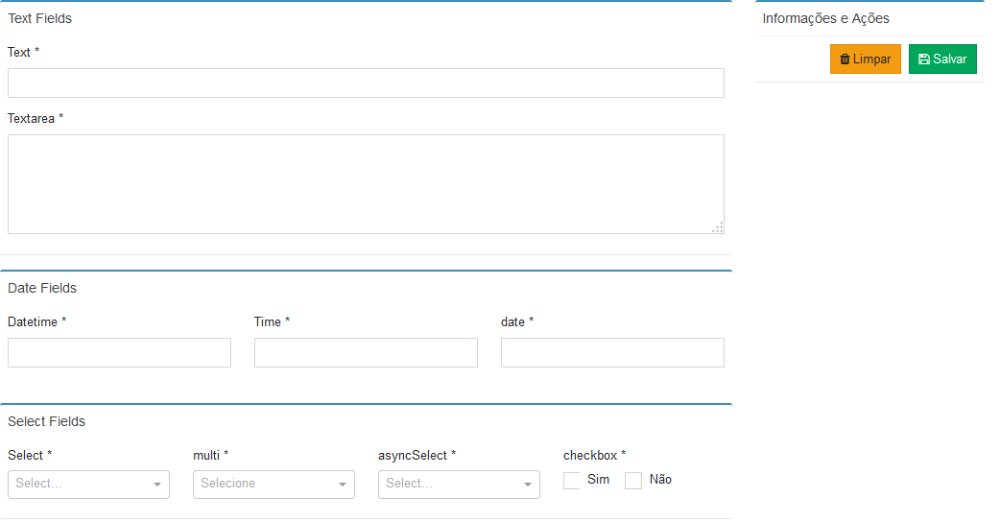

# React Json From
A React component that generates forms from a json

## Por quê?
Criar formulários em React às vezes pode ser um tanto quanto verboso.
E em cenários onde um sistema web possui muitos formulários, o esforço para criar formulários acaba consumindo muito tempo e esse trabalho geralmente é bastante repetitivo.
___

## :: Iniciando

#### Componente
```
import JsonForm from 'react-json-form';
```
#### Estilo
Você pode importar o **Bootstrap**, **Font Awesome** e **Admin Lte** separadamente de acordo com necessidade do seu projeto ou importar o arquivos `default.css` disponível no módulo.
```
import 'react-json-form/dist/JsonForm/styles/defaults.css';
```

#### Demonstração Básica 
Para demonstrar as possibilidades do **React Json Form** se não for passado nenhum parâmetro ao componente ele irá renderizar um formulário de exemplo.
```
<JsonForm />
```


#### Exemplo
```
<JsonForm
    layout={this.state.layout}
    onSuccess={(data, layout) => { this.onSuccess(data, layout); }}
    onError={(data, layout) => { this.onError(data, layout); }}
    initialData={this.props.formData}
/>
```
Note que temos 4 propriedades básicas:


| Prop   |      Descrição      |  Exemplo |
|----------|-------------|------|
| layout |  Array objetos que definem as áreas, os campos e as condições de validação. | <a href="#layout">exemplo</a>   |
| onSuccess |  função que ao formulário passar por todas as validações recebe o json do formulário preenchido e o novo layout com os valores atualizados   |  `(data, layout) => { cosole.log(data, layout); }` |
| onError | função que ao formulário falhar em validação recebe o json do formulário preenchido e o novo layout com os valores atualizados |  `(data, layout) => { cosole.log(data, layout); }` |
| initialData | Json com os valores iniciais do formulário | `{name: "Foo", phone: "bar"}` |


#### Layout
```
[
    {
      title: 'Dados pessoasis',
      grid: [
        [
          {
            model: {
              type: 'text',
              name: 'name',
              value: '',
              label: 'Text',
              required: true,
              validation: (val) => {
                if (val.length < 10) {
                  return { valid: false, message: 'O campo nome deve conter mais de 10 caracteres' };
                }
                return { valid: true, message: 'ok' };
              },
            },
            colProps: { md: 12 },
          },
        ],
        [
          {
            model: {
              type: 'textarea',
              name: 'phone',
              value: '',
              label: 'Textarea',
              required: false,
            },
            colProps: { md: 12 },
          },
        ],
      ],
    }
  ]
```
